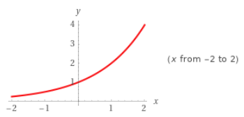
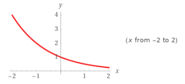
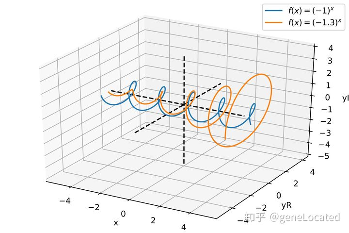
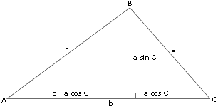

# 预备知识

函数和图形，是微积分的主要建筑材料。

> https://www.zhihu.com/question/339345734/answer/800503801

函数只有**初等函数**和**非初等函数**的区别，初等函数是由刘维尔划定的六大基本初等函数(**反对幂三指常**)复合而成的函数, 其他都叫非初等函数。对于非业内人士, 得默认他们只懂初等函数：

- **代数函数**：只包含常数与自变量相互之间有限次的加、减、乘、除、有理指数幂和开方六种运算的函数，包括：
  - **常函数**
  - **幂函数**：多项式函数可用于近似其他函数，并且性质相对简单
- 超越函数：非代数函数都是超越函数，包括
  - **指数函数**：用于描述增长与衰减
  - **对数函数**
  - **三角函数**：用于描述循环、重复的周期活动
  - **反三角函数**

## 直线

### 斜率

两条互相垂直的线，斜率乘积为 -1。

### 直线方程

- **点斜式**：$ y - y_1 = m(x - x_1) $
- **斜截式**：$ y = mx + b $
- **截距式**：$ \frac{x}{c} + \frac{y}{d} = 1 $
- **一般式**：$ Ax + By + C = 0 $
- **两点式**：$ \frac{y-y_1}{y_2-y1} = \frac{x-x_1}{x_2-x_1} $

### 回归分析

根据采样得到的散点进行函数拟合。

## 函数和图形

### 定义域和值域

### 增减性

### 奇偶性：对称性

- 偶函数：对于函数 $ y = f(x) $ 定义域中的所有 $ x $ 都有 $ f(-x) = f(x) $。
- 奇函数：对于函数 $ y = f(x) $ 定义域中的所有 $ x $ 都有 $ f(-x) = -f(x) $。

### 平移

### 复合函数

## 指数函数

### 定义

设 $ a $ 为不等于 1 的正实数，则 $ f(x) = a^x $ 是底数为 $ a $ 的**指数函数**。

- 当 $ a > 1 $ 时，$ f(x) = a^x $ 为**增函数**，如 $ f(x) = 2^x $

  

- 当 $ 0 < a < 1 $ 时，$ f(x) = a^x $ 为**减函数**，如 $ f(x) = (1/2)^x $

  

> 底数为负数的指数函数需要在负数坐标系下画出，投影到实数坐标系是离散的
>
> https://www.zhihu.com/question/42686640
>
> 

### 指数法则

若 $ a > 0, b > 0 $，对于所有实数 $ x, y $，以下结果成立：

- $ a^x \cdot a^y = \begin{matrix} \underbrace{ a \cdot \ldots \cdot a } \\ x \end{matrix} = \begin{matrix} \underbrace{a \cdot \ldots \cdot a} \\ y \end{matrix}= a^{x+y} $
- $ (a^x)^y = \begin{matrix} \underbrace{a^x \cdot \ldots \cdot a^x} \\ y \end{matrix} = (a^y)^x = a^{xy} $
- $ a^x \cdot b^x = (ab)^x $

### 自然指数函数

对自然、物理和经济现象的建模中用到的最重要的指数函数是**自然指数函数**，它的基底为 $ e $。

其中，$ e $ 的**定义**为：$ e = \lim_\limits{x\to\infty} (1 + \frac{1}{x}) $ 。

指数函数 $ y = e^{kx} $ 常被用作指数增长或衰减模型。

$ y = P \cdot e^{rt} \approx y = P \cdot (1 + r)^t $ ，因为泰勒展开后省略高次项为 $ e^r \approx (1 + r) $ ？

实际应用中，常常计算在某个利率下何时翻倍，有两种方法：

- $ (1+r)^t=2 \Rightarrow t=\log_{1+r}2 \Rightarrow t=\frac{\log_{2}2}{log_{2}(1+r)} \Rightarrow t = \frac{1}{\log_{2}(1+r)}$
- $ e^{rt}=2 \Rightarrow rt=\ln2 \Rightarrow t=\frac{\ln2}{r} \Rightarrow t=\frac{69}{100 \cdot r} $

可以看到自然底数的公式更容易计算，由于 72 比 69 拥有更多的因数，所以一般选择 72 来计算，又称为 **72 法则**。

## 反函数和对数函数

### 一对一函数

每当 $ a \neq b $ 时， $ f(a) \neq f(b) $，满足**水平线法则**

### 反函数

由逆转一对一函数的定义域和值域定义的函数就是 $ f $ 的反函数，记作 $ f^{-1} $ 。

反函数的测试方法：函数 $ f $ 和 $ g $ 为反函数对，当且仅当 $ f(g(x)) = x $ 且 $ g(f(x)) = x $，这是 $ g = f^{-1} $ 且 $ f = g^{-1} $。

### 求反函数

找到 y 轴上的 y，然后找到 y 对应的 x，即 $ x = f^{-1}(y) $，该过程可以看作将原来的 y 轴看作 x 轴，x 轴看作 y 轴，相当于沿着 $ y = x $ 翻转。

### 对数函数

#### 定义

设 $ a $ 为不等于 1 的正实数，以 $ a $ 为底的指数函数 $ f(x) = a^x $ 为一对一函数，则它的反函数称为以 $ a $ 为底的对数函数。

#### 反函数性质

因为 $ f(x) = a^x $ 和 $ g(x) = \log_{a}x $ 互为反函数，则当 $ a > 0, a\neq 1, x > 0 $：

- $ f(g(x)) = x \Rightarrow a^{\log_{a}x} = x $
- $ g(f(x)) = x \Rightarrow \log_{a}{a^x} = x $

####  对数法则

对于任意 $ x > 0, y > 0 $ 有：

- 乘积法则：$ \log_{a}xy = \log_{a}x + \log_{a}y $，单位长度坐标系下的**乘除法运算**转换到指数坐标系下变成**加减法**，方便计算
- 幂法则：$ \log_{a}{x^y} = y \cdot \log_{a}x $，单位长度坐标系下某个数的**幂和开方运算**转换到指数坐标系下变成**乘除法**，方便计算
- 换底公式：$ \log_{a}x = \frac{\log_{b}x}{log_{b}a} $，一般来说，会有对数表记录常用的 $ \log_{10}x, \ln{x} $，这时可以将 $ b $ 等于 10 或者 $ e $，然后查表计算

> - 乘积法则
>   $$
>   \begin{align}
>   \log_{a}xy &= \log_{a}(xy) \\
>   &= \log_{a}{(a^{\log_{a}x} \cdot a^{\log_{a}y})}, \text{反函数性质} \\
>   &= \log_{a}{a^{(\log_{a}{x} + \log_{a}{y})}}, \text{指数法则} \\
>   &= (\log_{a}{x} + \log_{a}{y}), \text{反函数性质} \\
>   &= \log_{a}{x} + \log_{a}{y}
>   \end{align}
>   $$
>
> - 幂法则
>   $$
>   \log_{a}xy = \log_{a}x + \log_{a}y \\
>   \Downarrow \\
>   \log_{a}x \cdot x = \log_{a}x + \log_{a}x \\
>   \Downarrow \\
>   \log_{a}x \cdot x = 2 \cdot \log_{a}x \\
>   \Downarrow \\
>   \log_{a}{x^y} = y \cdot \log_{a}x
>   $$
>
> - 换底公式
>   $$
>   \begin{align}
>   \log_{b}{x} &= \log_{b}{a^{\log_{a}{x}}} \\
>   \log_{b}{x} &= \log_{a}{x} \cdot \log_{b}{a} \\
>   \log_{a}{x} &= \frac{log_{b}{x}}{\log_{b}{a}}
>   \end{align}
>   $$

指数部分提到 $ a^x $ 可以由 $ e^{rt}$ 转换实际上就是借用了反函数性质和幂法则得到： $ a^x = e^{\ln{a^x}} = e^{x\ln{a}}$。

利用**乘除法变加减法**，**幂运算开方变乘除法**，在电子计算器出现之前，有过辉煌一段时间的**对数尺**，通过滑动两个指数坐标的尺子，方便计算乘除法、幂运算和开方。

> https://www.zhihu.com/question/26097157/answer/121067428
>
> http://www.360doc.com/content/16/0622/18/26166517_569864394.shtml

## 三角函数及其反函数

### 弧度

在半径为 $ r $ 的圆中，沿着圆周走过的弧长与半径之比为对应张开的角的**弧度**，即 $ \theta = \frac{s}{r} $，因此 $ s = r $ 时，$ \theta = 1 (rad) $，注意，rad 不是单位， 因为弧度无量纲。

> 图片来自 https://zh.wikipedia.org/wiki/%E5%BC%A7%E5%BA%A6

>  https://www.zhihu.com/question/40759023
>
> 角度的出现，是源于对太阳的观察，古人观察出一年大概是 360 天，因此将天等分成 360 份，演变成圆为 360 度。
>
> 弧度的出现是顺应了大航海时代的到来，大家意识到地球是圆的，因此航行的路程与某个角度相对应，将 1 弧度定义为弧长与半径长度之比为 1:1 时对应的角度，航海者知道航行的距离，可以得到对应的弧度，可以得到对应的经纬度。
>
> 可以说，角度是从中心向四周观察，弧度是从四周向中心观察。

### 基本三角函数的定义

- 正弦：$ \sin \theta = \frac{y}{r} $
- 余割：$ \csc \theta = \frac{r}{y} $
- 余弦：$ \cos \theta = \frac{x}{r} $
- 正割：$ \sec \theta = \frac{r}{x} $
- 正切：$ \tan \theta = \frac{y}{x} $
- 余切：$ \cot \theta = \frac{x}{y} $

### 周期性

周期函数的**定义**：如果存在整数 $ p $ 使得对于每个 $ x $ 值有 $ f(x+p) = f(x) $，则 $ f(x) $ 为周期函数，且周期为 $ p $。

### 奇偶性

### 平移缩放

$ f(x) = A \sin{[\frac{2\pi}{B}(x - C)] + D} $

### 性质

- $ \cos^2\theta + \sin^2\theta = 1 $
- $ \cos(A+B) = \cos{A}\cos{B} - \sin{A}\sin{B} $
- $ \sin(A+B) = \sin{A}\cos{B} + \cos{A}\sin{B} $

### 余弦定理

$ c^2 = a^2 + b^2 - 2ab\cos{C}$

证明：$ (a\sin{C})^2 + (b-a\cos{C})^2 = c^2 $

### 正弦定理

$ \frac{\sin{A}}{a} = \frac{\sin{B}}{b} = \frac{\sin{C}}{c} $

证明：$ c \cdot \sin{A} = h = a \cdot \sin{C} $

### 反三角函数

$ \arcsin, \arccos $ 中的 arc 指的是：单位圆中，求中心角对应的弧度即求对应的弧长 arc，因为单位圆中 $ \theta = \frac{s}{r} $ 变成 $ \theta = s $

## 参数方程

参数方程式为了解决水平线和垂直线与函数图形都有多个焦点的情况，因为这意味着我们不能用 $ y = f(x) $ 也不能用 $ x = g(y) $ 来表示该图形。这时引入参数方程：
$$
\begin{cases}
x = f(t) \\
y = g(t)
\end{cases}
$$
对于研究运动的情况，$ t $ 通常表示时间，这样的方程比笛卡尔公式（即 $ y = f(x) $ 或 $ x = g(y) $）更好，因为带 $ t $ 的参数方程告诉我们任一时刻 $ t $ 对应的质点位置 $ (x, y) = (f(t), g(t)) $。

曲线的参数化包括：

- 参数方程
- 定义区间

### 参数化反函数

$$
\begin{cases}
x = f(t) \\
y = g(t)
\end{cases}
\Rightarrow
\begin{cases}
y = f(t) \\
x = g(t)
\end{cases}
$$

### 标准参数化

- 圆：$ x^2 + y^2 = a^2 $
  $$
  x = a\cos{t} \\
  y = a\sin{t} \\
  0 \leq t \leq 2\pi
  $$

- 椭圆：$ \frac{x^2}{a^2} + \frac{y^2}{b^2} = 1 $
  $$
  x = a\cos{t} \\
  y = b\sin{t} \\
  0 \leq t \leq 2\pi
  $$
  

## 对变化建立函数模型

构建模型的步骤：

- 识别问题
- 对要包括的变量以及变量间的关系作出假设
- 求一个满足这些关系的函数或图形
- 检验模型
- 用于预测将来

