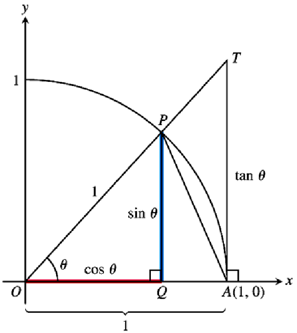

# 极限和连续

极限的概念是微积分有别于代数和几何的其中一个概念。

极限的几何应用：定义函数图形的切线，从而引出导数的概念。

## 变化率和极限

### 平均与瞬时速度

### 平均变化率和割线

连接曲线上的两点的直线就是该曲线的**割线**，当两点趋于接近时就变成**切线**。

### 极限的非正式定义

$ f(x) $ 在包含 $ x_0 $ 的区间内均有定义（在 $ x_0 $ 处可以没有定义，即不连续），如果对于充分靠近的 $ x $，$ f(x) $ 能任意接近 $ L $，则我们定义 $ x \to x_0 $ 时 $ f $ 趋于**极限** $ L $，记作
$$
\lim_{x \to x_0} f(x) = L
$$
其中不正式的地方在于**充分靠近**和**任意接近**都不是准确的定义。

极限不依赖在 $ x_0 $ 处 $ f(x) $ 的定义。

### 极限可能不存在

- 阶跃函数：
  $$
  f(x) =
  \begin{cases}
  0, x < 0 \\
  1, x \leq 0
  \end{cases}
  $$

- 函数无穷大
  $$
  f(x) = \frac{1}{x}
  $$

- 函数无限震荡
  $$
  f(x) = \sin{\frac{1}{x}}
  $$

### 极限的正式定义

$ f(x) $ 在包含 $ x_0 $ 的区间内均有定义（在 $ x_0 $ 处可以没有定义，即不连续），

如果对于任意给定的数 $ \epsilon > 0 $，都存在 $ \delta > 0 $，使得当 $ 0 < \left\vert x - x_0 \right\vert < \delta $ 时，有 $ \left\vert f(x) - L \right\vert < \epsilon $，则有
$$
\lim_{x \to x_0} f(x) = L
$$
即我们如果给定了 $ \epsilon $，能通过 $ \epsilon $ 来表示出 $ \delta $ 则说明**极限存在**。

> 例 10：证明极限 $ \lim_\limits{x \to 5} \sqrt{x - 1} = 2 $
>
> 证明：
>
> - 关于 $ \epsilon $：
>   $$
>   \left\vert \sqrt{x - 1} - 2 \right\vert < \epsilon \\
>   -\epsilon < \sqrt{x - 1} - 2 < \epsilon \\
>   2 - \epsilon < \sqrt{x - 1} < 2 + \epsilon \\
>   {(2 - \epsilon)}^2 < x - 1 < {(2 + \epsilon)}^2 \\
>   {(2 - \epsilon)}^2 + 1 < x < {(2 + \epsilon)}^2 + 1
>   $$
>
> - 关于 $ \delta $：
>   $$
>   0 < \left\vert x - 5 \right\vert < \delta \\
>   -\delta < x - 5 < \delta \\
>   5 - \delta < x < 5 + \delta \\
>   $$
>
> - 综上：
>
>   确保
>   $$
>   \begin{cases}
>    {(2 - \epsilon)}^2 + 1 < 5 - \delta \\
>    {(2 + \epsilon)}^2 + 1 < 5 + \delta
>   \end{cases}
>   $$
>   都满足，则可以保证 $ \left\vert \sqrt{x - 1} - 2 \right\vert < \epsilon $ 成立，即 $ \lim_\limits{x \to 5} \sqrt{x - 1} = 2 $

## 求极限和单侧极限

前面求极限是通过图形和数值逼近的方法来求取，接下来将是代数计算求取极限。

### 代入法求代数函数极限

**定理 1** 极限法则：

如果 $ L, M, c, k $ 都是实数，且
$$
\lim_{x \to c} f(x) = L \\
\lim_{x \to c} g(x) = M
$$
那么，
$$
\lim_{x \to c} (f(x) + g(x)) = L + M \\
\lim_{x \to c} (f(x) - g(x)) = L - M \\
\lim_{x \to c} (f(x) \cdot g(x)) = L \cdot M \\
\lim_{x \to c} (k \cdot f(x)) = k \cdot L \\
\lim_{x \to c} (\frac{f(x)}{g(x)}) = \frac{L}{M} \\
\lim_{x \to c} ({f(x)}^{\frac{r}{s}}) = L^{\frac{r}{s}}, 其中 r 和 s 都是整数且 s \neq 0
$$
利用**定理 1**以及**常函数** $ f(x) = k $ 和**恒等函数** $ f(x) = x $ 推导出**定理 2**

- $ \lim\limits_{x \to c} k = k $
- $ \lim\limits_{x \to c} x = c $

$$
\begin{align}
\lim_{x \to c}(x^3 + 4x -3) &= (\lim_{x \to c}x^3) + (\lim_{x \to c}4x^2) - (\lim_{x \to c}3) & 和差法则 \\
& = (c^3) + (4c^2) - (3) & 积法则，数乘法则，\lim_{x \to c} x = c，\lim_{x \to c} k = k
\end{align}
$$

**定理 2** 可用代入法求多项式的极限：

如果 $ P(x) = a_n x^n + a_{n-1} x^{n-1} + \ldots + a_0 $，那么
$$
\lim_{x \to c} P(x) = P(c) = a_n c^n + a_{n-1} c^{n-1} + \ldots + a_0
$$
**定理 3** 可用代入法求有理函数的极限，如果坟墓的极限不为 0：

如果 $ P(x) $ 和 $ Q(x) $ 都是多项式且 $ Q(c) \neq 0 $，那么，
$$
\lim_{x \to c} \frac{P(x)}{Q(x)} = \frac{P(c)}{Q(c)}
$$

> - 代数函数：只包含常数与自变量相互之间有限次的加、减、乘、除、有理指数幂和开方六种运算的函数，包括：
>   - **常函数**
>   - **幂函数**：多项式函数可用于近似其他函数，并且性质相对简单
> - 超越函数：非代数函数都是超越函数，包括
>   - **指数函数**
>   - **对数函数**
>   - **三角函数**
>   - **反三角函数**

### 消去零分母求极限

### 夹逼准则求极限

**定理 4** 夹逼准则：

如果在包含 $ c $ 在内的某个区间中（函数在 c 处可以没有定义），有 $ g(x) \leq f(x) \leq h(x) $，并且 $ \lim\limits_{x \to c} g(x) =  \lim\limits_{x \to c} h(x) = L $，那么 $ \lim\limits_{x \to c} f(x) = L $。（通过分成左右侧极限以及极限的正式定义证明）

例 6 中，通过夹逼准则证明 $ \lim\limits_{\theta \to 0} \sin{\theta} = 0 $ 和 $ \lim\limits_{\theta \to 0} \cos{\theta} = 1 $，为什么不直接代入呢？因为三角函数是**超越函数**，而上面的代入法只适用于代数函数。

### 单侧极限

有理函数的极限定理以及夹逼准则对单侧极限都适用。

**定理 5** 单侧极限和双侧极限之间的关系：
$$
\lim_{x \to c} f(x) = L \Leftrightarrow
\begin{cases}
\lim_{x \to c^-} f(x) = L \\
\lim_{x \to c^+} f(x) = L
\end{cases}
$$

### 关于 $ \sin{\theta} / \theta $ 的极限

**定理 6**
$$
\lim_{\theta \to 0} \frac{\sin{\theta}}{\theta} = 1
$$

> 证明：
>
> 
> $$
> S_{\triangle OAP} < S_{扇形 OAP} < S_{\triangle OAT} \\
> \begin{cases}
> S_{\triangle OAP} = \frac{1}{2} \cdot OA \cdot (OP \cdot \sin{\theta}) = \frac{1}{2} \sin{\theta} \\
> S_{扇形 OAP} = \frac{\theta}{2\pi} \cdot \pi r^2 = \frac{1}{2}\theta \\
> S_{\triangle OAT} = \frac{1}{2} \cdot OA \cdot (OA \cdot \tan{\theta})
> \end{cases}
> \\
> \Downarrow \\
> \sin{\theta} < \theta < \tan{\theta} \\
> \theta \to 0^+ 时，不等式化为：1 < \frac{\theta}{\sin{\theta}} < \frac{1}{\cos{\theta}} \\
> 即 \cos{\theta} < \frac{\sin{\theta}}{\theta} < 1 \\
> 因为 \lim_{\theta \to 0^+} \cos{\theta} = 1\\
> 所以根据夹逼准则有： \lim_{\theta \to 0^+} \frac{\sin{\theta}}{\theta} = 1 \\
> 又因为 \sin{\theta} 和 \theta 均为奇函数 \\
> 则 \frac{\sin{\theta}}{\theta} 为偶函数 \\
> 所以 \lim_{\theta \to 0^-} \frac{\sin{\theta}}{\theta} = 1 \\
> 所以 \lim_{\theta \to 0} \frac{\sin{\theta}}{\theta} = 1
> $$

## 与无穷有关的极限

### $ x \to \pm\infty $ 的有限极限

**定理 7** $ x \to \pm\infty $ 的极限法则:

如果 $ L, M, c, k $ 都是实数，且
$$
\lim_{x \to \pm\infty} f(x) = L \\
\lim_{x \to \pm\infty} g(x) = M
$$
那么，
$$
\lim_{x \to \pm\infty} (f(x) + g(x)) = L + M \\
\lim_{x \to \pm\infty} (f(x) - g(x)) = L - M \\
\lim_{x \to \pm\infty} (f(x) \cdot g(x)) = L \cdot M \\
\lim_{x \to \pm\infty} (k \cdot f(x)) = k \cdot L \\
\lim_{x \to \pm\infty} (\frac{f(x)}{g(x)}) = \frac{L}{M}，其中 M \neq 0 \\
\lim_{x \to \pm\infty} ({f(x)}^{\frac{r}{s}}) = L^{\frac{r}{s}}, 其中 r 和 s 都是整数且 s \neq 0
$$

### $ x \to \pm\infty $ 的有理函数的极限

在前面，首先求取 $ y =k $ 和 $ y = x $ 的极限，然后利用极限法则，并通过应用了有关代数组合函数的极限定理推广了这些结果到有理函数。在这里，可以用过 $ y = k $ 和 $ y = \frac{1}{x} $ 来做相似的事情，只需要分子分母同时除以 $ x $ 的最高次幂。

- 分子分母同次，极限为常数
- 分子次数小于分母次数，极限为 0
- 分子次数大于分母次数，极限为无穷

### 渐近线与无穷极限

- 水平渐近线：$ \lim\limits_{x \to +\infty} f(x) = c $ 或 $ \lim\limits_{x \to -\infty} f(x) = c $
- 垂直渐近线：$ \lim\limits_{x \to c^+} f(x) = \pm\infty$ 或者 $ \lim\limits_{x \to c^-} f(x) = \pm\infty$

### 无穷极限与夹逼准则

### 无穷极限的精确定义

$ f(x) $ 在包含 $ x_0 $ 的区间内均有定义（在 $ x_0 $ 处可以没有定义，即不连续），

如果对于任意给定的数 $ B $，都存在 $ \delta > 0 $，使得当 $ 0 < \left\vert x - x_0 \right\vert < \delta $ 时，有 $ \left\vert f(x) - L \right\vert > B $，则有
$$
\lim_{x \to x_0} f(x) = \infty
$$
$ f(x) $ 在包含 $ x_0 $ 的区间内均有定义（在 $ x_0 $ 处可以没有定义，即不连续），

如果对于任意给定的数 $ -B $，都存在 $ \delta > 0 $，使得当 $ 0 < \left\vert x - x_0 \right\vert < \delta $ 时，有 $ \left\vert f(x) - L \right\vert < -B $，则有
$$
\lim_{x \to x_0} f(x) = -\infty
$$

### 终极性态度模型和渐近线

- 当分子分母同次，通过将有理函数变形成常数加无穷极限趋于 0 的余项，可以得到水平渐近线
- 当分子比分母次数高 1，通过将有理函数变形成一次项加常数项加无穷极限趋于 0 的余项，可以得到斜渐近线

> 例 43, 44：对于带根号的式子求极限，一般通过分子分母同时乘以共轭来消去根号

## 连续性

### 在一点的连续性（与极限相关）

在一点的连续性**定义**：

- **内点**的连续性：如果 $ \lim\limits_{x \to c} f(x) = f(c) $，则 $ f(x) $ 在内点 $ c $ 处是连续的
- **端点**的连续性：如果 $ \lim\limits_{x \to a^+} f(x) = f(a) $ 或者 $ \lim\limits_{x \to b^-} f(x) = f(b) $，则 $ f(x) $ 在左端点 $ a $ 或右端点 $ b $ 是连续的

> 维基百科中写道，连续函数，直观上来说，连续函数就是当输入值变化足够小的时候，输出的变化也随之足够小的函数。
>
> 如果不用极限来定义连续，可以用 $ \epsilon - \delta $ 来定义。

**间断**的分类：

- 可去间断（在间断点处的双侧极限相等）
- 不可去间断（在间断点处的极限不存在）
  - 跳跃间断：阶跃函数
  - 无穷间断：$ f(x) = \frac{1}{x}$
  - 振荡间断：$ f(x) = \sin{\frac{1}{x}} $

### 连续函数

定义：在函数的定义域中每一个点连续（**包括单侧连续和双侧连续**）。但是连续函数不一定在所有可能的区间上连续，比如 $ f(x) = 1/x $ 的定义域为 $ (-\infty,0) \bigcup (0, \infty) $，它是连续函数，因为它在定义域中的每一个点连续，但在包含 $ x = 0 $ 的区间不连续，比如 $ (-1, 1) $，它在 $ x = 0  $ 处有一个间断点，因为它在 $ x = 0 $ 处没有定义。

连续函数的**反函数**也是连续函数。

### 连续函数的代数组合也是连续

**定理 8** 连续函数的代数组合性质：

两个函数 $ f $ 和 $ g $ 在 $ x = c $ 处连续，那么他们的组合在 $ x = c $ 处也连续。

- 和
- 差
- 积
- 常数积
- 商

> 基本都可以通过极限法则来证明。

### 连续函数的复合也是连续

### 连续函数的中间值定理（介值定理，不是中值定理）

**定理 10** 连续函数的中间值定理：

在闭区间 $ [a, b] $ 上连续的函数，一定能取到 $ f(a) $ 和 $ f(b) $ 中间的任何值。即如果 $ y_0 $ 是 $ f(a) $ 和 $ f(b) $ 之间的任何值，那么 $ [a, b] $ 中必然存在 $ c $ 使得 $ f(c) = y_0 $。

> 假设有有一个连续函数 $ f:[a,b] \mapsto \mathbb{R} $ ，且 $ f(a) < f(b) $ ，对于任意数 $ u $ 满足 $ f(a) < u < f(b) $，则存在一点 $ c, a < c < b $，使得 $ f(c) = u $，当 $ f(a) < f(b) $ 时有类似叙述。

几何上：$ f(a), f(b) $ 之间的水平线与 $ f(x) $ 至少相交一次。

**应用**：零点存在性，方程的根的存在性

## 切线

继续前面切线和割线的讨论，通过计算**割线**的斜率的**极限**来求曲线的**切线**.

### 什么是曲线的切线

对于圆来说，切线的概念相当直接，但是对于曲线，则不是。为了引入曲线的切线的概念，需要一种动态方法：

- 从能计算的东西开始，即割线 PQ 的斜率
- 研究点 Q 沿着曲线趋于点 P 时**割线**的**极限**
- 如果极限存在，将它作为曲线在点 P 的**斜率**，并把过点 P 且斜率具有该斜率的曲线定义为曲线在点 P 的**切线**

切线是 17 世纪早期首要的数学问题：

- 在光学中，切线决定光线射入弯曲的镜头的角度
- 在力学中，切线是物体沿着运动路径每一点的运动路径
- 在几何学中，两条曲线相交点处的切线决定了两条曲线在该点的相交角

通过 $ \lim\limits_{\Delta x_0 \to 0} \frac{f(x_0 + \Delta x) - f(x_0)}{\Delta x}$ 可以得到函数曲线在 $ x_0 $ 处的斜率，继而根据过 $ (x_0, f(x_0)) $ 点，得到切线**点斜式**方程。

### 求函数图形的切线

### 变化率：在一点处的导数

**商差**：表达式 $ \frac{f(x_0 + h) - f(x_0)}{h} $ 称为 $ f $ 在 $ x_0 $ 处，增量为 $ h $ 的商差

**导数**：如果 $ h \to 0 $ 时商差有极限，那么这个极限就称为 $ f $ 在 $ x_0 $ 的导数。

> 例 27：如果要判断间断点切线是否存在，需要判断 $ \frac{f(x_0 + h) - f(x_0)}{h} $ 的双侧极限，即
>
> - $\lim\limits_{h \to -\infty} \frac{f(x_0 + h) - f(x_0)}{h} $，千万注意 h 为负数，不要搞错最后结果的正负号
> - $ \lim\limits_{h \to +\infty} \frac{f(x_0 + h) - f(x_0)}{h} $

## 附加习题：理论、例子、应用

### 给 $ 0^0 $ 指定值

根据指数法则：

- 若 $ a \neq 0 $，则 $ a^0 = 1 $
- 若 $ n > 0 $，则 $ 0^n = 0 $

但想推广到 $ 0^0 $ 却发现无法使用上述两个结论

实际上，$ 0^0 $ 可以得到任何值？

- 通过 0.1, 0.01, 0.001 逼近 0，可以发现 $ \lim\limits_{x \to 0} x^x = 1 $
- 通过 100, 1000, 10000 逼近 $ \infty $，可以发现 $ \lim\limits_{x \to \infty} (\frac{1}{x})^{1/\ln{x}} = 1/\mathrm{e} $

